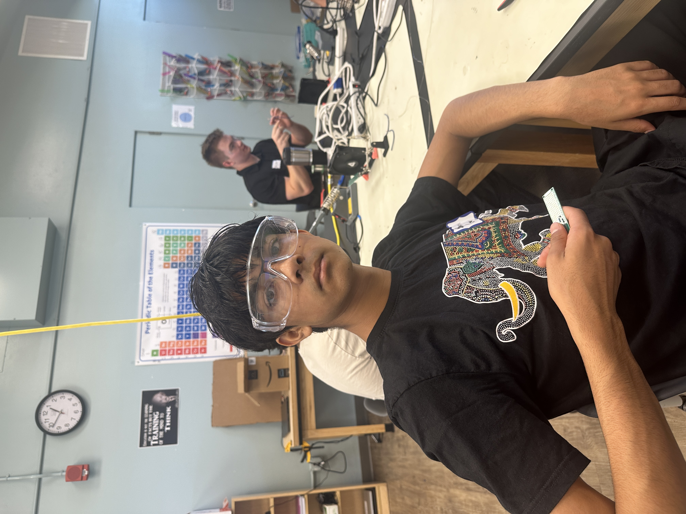
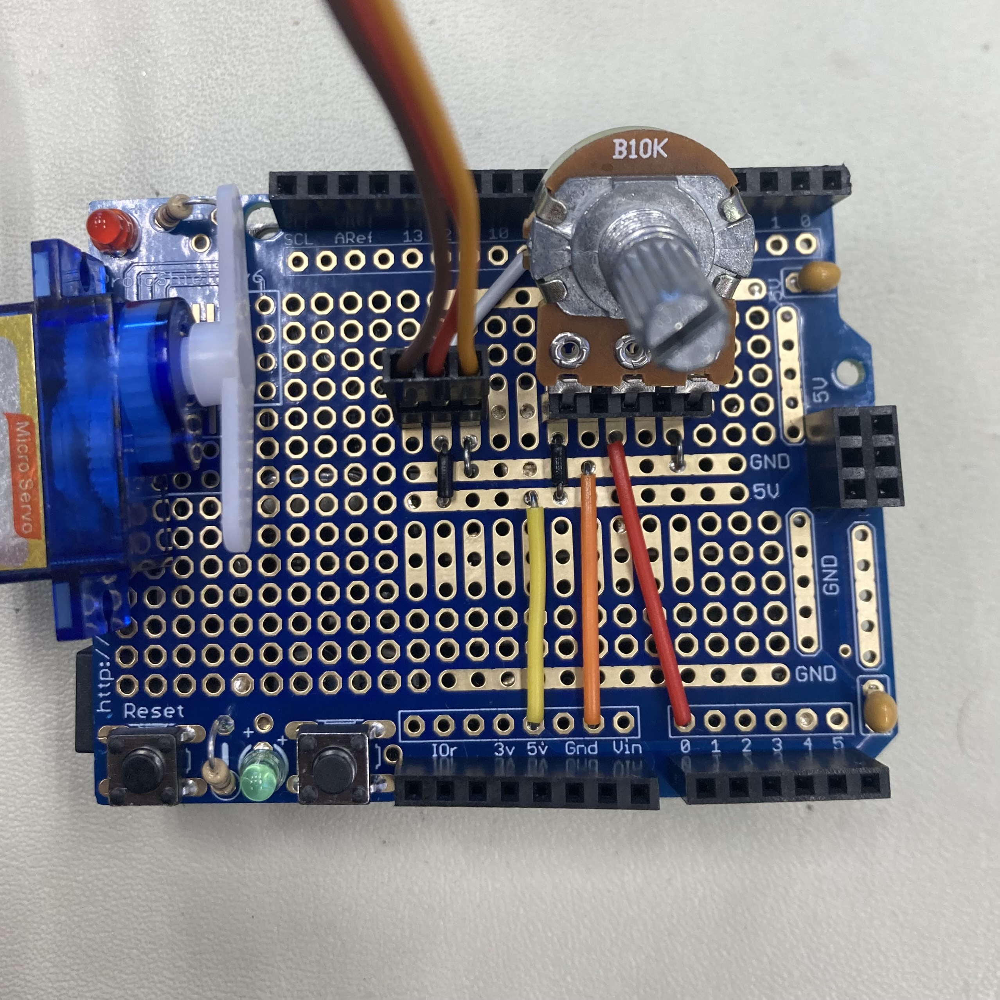

# COLOR GLOVE SYNTHESIZER
<!-- Replace this text with a brief description (2-3 sentences) of your project. This description should draw the reader in and make them interested in what you've built. You can include what the biggest challenges, takeaways, and triumphs from completing the project were. As you complete your portfolio, remember your audience is less familiar than you are with all that your project entails! -->

<!---You should comment out all portions of your portfolio that you have not completed yet, as well as any instructions:-->
<!--- This is an HTML comment in Markdown -->
<!--- Anything between these symbols will not render on the published site -->
# U
<details>

   ### You can add a header

   You can add text within a collapsed section. 

   You can add an image or a code block, too.

   ```ruby
   puts "Hello World"
   ```

</details>

| **Engineer** | **School** | **Area of Interest** | **Grade** |
|:--:|:--:|:--:|:--:|
| Shreyan G | Lynbrook | Mechanical Engineering | Incoming Sophmore

<!-- **Replace the BlueStamp logo below with an image of yourself and your completed project. Follow the guide [here](https://tomcam.github.io/least-github-pages/adding-images-github-pages-site.html) if you need help -->



  
# Final Milestone

<iframe width="560" height="315" src="https://www.youtube.com/embed/s69xmo84BM4?si=Y1eVY08nkV2qWN_b" title="YouTube video player" frameborder="0" allow="accelerometer; autoplay; clipboard-write; encrypted-media; gyroscope; picture-in-picture; web-share" referrerpolicy="strict-origin-when-cross-origin" allowfullscreen></iframe>

## Summary

So far since the last milestone I have adjusted the values for the colors with an algorithm to find the average value of the color. The overall outcome of this project has been a glove that can detect specific colors and play a corresponding note. So far my biggest challenge in bluestamp was getting the sensitivity of my color sensor right, seeing my trouble an instructor nudged me in the direction of using an algorithm to find the right values for each color. Solving this problenm has been my biggest triumph. So far I have learned about circuitpy, github, color values, audio/speakers, and microcontrollers through my time working on this project and in BSE. In the future I hope to learn more about CAD and assembley of electronics.
<!--For your final milestone, explain the outcome of your project. Key details to include are:
- What you've accomplished since your previous milestone
- What your biggest challenges and triumphs were at BSE
- A summary of key topics you learned about
- What you hope to learn in the future after everything you've learned at BSE
-->
## Code
<details>

<summary>Tips for collapsed sections</summary>

```python
# SPDX-FileCopyrightText: 2023 John Park for Adafruit
# SPDX-License-Identifier: MIT
# Bricktunes LEGO Color Synth
# Feather RP2040 Prop-Maker +ma AS7341 Color Sensor
# Color comparison code and chime library by CGrover

import time
import math
import board
import digitalio
import audiobusio
from adafruit_as7341 import AS7341, Gain
import audiomixer
from cedargrove_chime import Chime, Voice, Material, Striker


TOLERANCE = 1000  # The color matching tolerance index (0 to 8 * max_sensor_count)


sensor = AS7341(board.STEMMA_I2C())
sensor.astep = 128  # (999) The integration time step size in 2.78 microsecond increments
sensor.atime = 50  # The integration time step count.
sensor.gain = Gain.GAIN_256X
sensor.led_current = 4  # increments in units of 4
sensor.led = True
max_sensor_count = (sensor.astep + 1) * (sensor.atime + 1)

# ===================================================
# color lists as 8-channel tuples (channels[0:8])
brick_full_spectrum_values = [
                                (93.73, 1420.34, 1136.94, 890.2, 611.73, 413.41, 457.08, 299.77), # Blue
                                (342, 428, 816, 2028, 4757, 5448, 5881, 3426), # Bright Lt Orange
                                (391, 2507, 2089, 2030, 2641, 3675, 5694, 3845), # Bright Pink
                                (109.3, 1074.6, 622.37, 465.32, 475.1, 497.74, 850.41, 1155.62), # Dark Purple
                                (182.15, 361.74, 727.82, 2139.39, 3225.02, 2459.06, 2226.94, 1038.07), # Lime
                                (155.45, 316.98, 314.04, 346.15, 519.93, 1193.47, 3459.11, 2824.04) # Red
]

brick_color_names = [
                        "Blue",
                        "Bright Light Orange",
                        "Bright Pink",
                        "Dark Purple",
                        "Lime",
                        "Red"
]

gap_state = False

# ===================================================
# audio setup
power = digitalio.DigitalInOut(board.EXTERNAL_POWER)
power.switch_to_output(value=True)
audio_output = audiobusio.I2SOut(board.I2S_BIT_CLOCK, board.I2S_WORD_SELECT, board.I2S_DATA)

mixer = audiomixer.Mixer(sample_rate=11020, buffer_size=4096, voice_count=1, channel_count=1)
audio_output.play(mixer)
mixer.voice[0].level = 0.15  # adjust this for overall volume

brickscale = [
        "E7", "E5", "D#7", "D#5", "C#7", "C#5"
]

# Instantiate the chime synthesizer with custom parameters
chime = Chime(
                mixer.voice[0],
                scale=brickscale,
                material=Material.SteelEMT,  # SteelEMT, Ceramic, Wood, Copper, Aluminum, Brass
                striker=Striker.Metal,  # Metal, Plexiglas, SoftWood, HardWood
                voice=Voice.Tubular,  # Bell, Perfect, Tubular
                scale_offset=-16
)


# Play scale notes sequentially
for index, note in enumerate(chime.scale):
    chime.strike(note, 3.0)
    time.sleep(0.1)
time.sleep(1)

def compare_n_channel_colors(color_1, color_2, tolerance=0):
    """Compares two integer multichannel count tuples using an unweighted linear
    Euclidean difference. If the color value difference is within the tolerance
    band of the reference, the method returns True.
    The difference value index `tolerance` is used to detect color similarity.
    Value range is an integer value from 0 to
    (maximum_channel_count * number_of_channels). Default is 0 (detects a
    single color value)."""
    # Create list of channel deltas using list comprehension
    deltas = [((color_1[idx] - count) ** 2) for idx, count in enumerate(color_2)]
    # Resolve squared deltas to a Euclidean difference
    # pylint: disable=c-extension-no-member
    delta_color = math.sqrt(sum(deltas))
    return bool(delta_color <= tolerance)

print("Bricktunes ready")

while True:
    sensor_color = sensor.all_channels
    if sensor_color[0] <= 70: # Detects if there is not brick
        if not gap_state:
            print("No Brick Detected")
            gap_state = True
    else:
        for i in range(len(brick_color_names)): # Iterates through the colors and compares them to the value the color sensor detects
            color_match = compare_n_channel_colors(sensor_color, brick_full_spectrum_values[i], TOLERANCE)
            if color_match is True:
                chime.strike(chime.scale[i], 7)
                gap_state = False
                print("sensor color:", sensor_color, "| ref:", brick_full_spectrum_values[i])
                print(brick_color_names[i])
                time.sleep(0.25) #Change this number if you want notes repeated more or less often when hovering over them
                break

""" Comment the while statement above and uncomment this then replace the value of the color you want with the resultant value in the serial montitor.
r_val = [0, 0, 0, 0, 0, 0, 0, 0]

print("initiating...")
time.sleep(0.5)
print("3")
time.sleep(1)
print("2")
time.sleep(1)
print("1")
print(processing...)
for i in range(100):
    s=list(sensor.all_channels)
    r_val = [x + y for x, y in zip(r_val, s)]
for i in range(8):
    r_val[i] = r_val[i]/100
print("the average value for your color is:" + r_val)

"""
```

</details>
# Second Milestone

<!--**Don't forget to replace the text below with the embedding for your milestone video. Go to Youtube, click Share -> Embed, and copy and paste the code to replace what's below.**-->

<iframe width="560" height="315" src="https://www.youtube.com/embed/D4r-M5sbj2g?si=xL69JCIFBoXLwTrW" title="YouTube video player" frameborder="0" allow="accelerometer; autoplay; clipboard-write; encrypted-media; gyroscope; picture-in-picture; web-share" referrerpolicy="strict-origin-when-cross-origin" allowfullscreen></iframe>

<!--
For your second milestone, explain what you've worked on since your previous milestone. You can highlight:
- Technical details of what you've accomplished and how they contribute to the final goal
- What has been surprising about the project so far
- Previous challenges you faced that you overcame
- What needs to be completed before your final milestone 
-->
## Summary

So far I have now enabled the sensor to detect what color it is facing by matching which color it is closest too on a spectrum of color values.

## Challenges

A challenge I faced was adjusting the sensitivity of the color sensor so it could accurately differentiate colors while stil being sensitive to what it was looking at. I overcame this with trial and error tweaking the sensitivity values.

## Code

```python
# SPDX-FileCopyrightText: 2023 John Park for Adafruit
# SPDX-License-Identifier: MIT
# Bricktunes LEGO Color Synth
# Feather RP2040 Prop-Maker +ma AS7341 Color Sensor
# Color comparison code and chime library by CGrover

import time
import math
import board
import digitalio
import audiobusio
from adafruit_as7341 import AS7341, Gain
import audiomixer
from cedargrove_chime import Chime, Voice, Material, Striker


DEBUG = False  # Useful for tuning reference color values by printing them
TOLERANCE = 1200  # The color matching tolerance index (0 to 8 * max_sensor_count)

sensor = AS7341(board.STEMMA_I2C())
sensor.astep = 128  # (999) The integration time step size in 2.78 microsecond increments
sensor.atime = 50  # The integration time step count.
sensor.gain = Gain.GAIN_256X
sensor.led_current = 4  # increments in units of 4
sensor.led = True
max_sensor_count = (sensor.astep + 1) * (sensor.atime + 1)

# ===================================================
# color lists as 8-channel tuples (channels[0:8])
brick_full_spectrum_values = [
                                (94, 1310, 1736, 1075, 592, 437, 497, 383),  # Blue
                                (148, 324, 838, 2577, 2363, 1259, 929, 819),  # Bright Green
                                (381, 576, 850, 1619, 3688, 5532, 6291, 4250),  # Bright Lt Orange
                                (404, 2300, 2928, 2385, 2679, 3804, 5576, 4284),  # Bright Pink
                                (545, 1276, 1513, 1178, 2291, 6579, 6579, 6486),  # Coral
                                (136, 1055, 1223, 745, 748, 768, 1205, 1100),  # Dark Purple
                                (85, 731, 1375, 1604, 1019, 557, 533, 370),  # Dark Turquoise
                                (451, 2758, 3786, 2880, 3007, 3064, 4539, 3656),  # Lavender
                                (214, 300, 771, 1811, 3245, 2897, 2051, 1392),  # Lime
                                (188, 341, 435, 507, 625, 1703, 4361, 3692),  # Red
                                (182, 870, 1455, 1799, 2149, 1879, 1702, 1273),  # Sand Green
                                (461, 497, 878, 2412, 4699, 5935, 6579, 4677)  # Yellow
]

brick_color_names = [
                        "Blue",
                        "Bright Green",
                        "Bright Light Orange",
                        "Bright Pink",
                        "Coral",
                        "Dark Purple",
                        "Dark Turquoise",
                        "Lavender",
                        "Lime",
                        "Red",
                        "Sand Green",
                        "Yellow"
]

brick_states = [False] * (len(brick_color_names))
gap_state = False

# ===================================================
# audio setup
power = digitalio.DigitalInOut(board.EXTERNAL_POWER)
power.switch_to_output(value=True)
audio_output = audiobusio.I2SOut(board.I2S_BIT_CLOCK, board.I2S_WORD_SELECT, board.I2S_DATA)

mixer = audiomixer.Mixer(sample_rate=11020, buffer_size=4096, voice_count=1, channel_count=1)
audio_output.play(mixer)
mixer.voice[0].level = 1  # adjust this for overall volume

brickscale = [
        "E4", "D5", "E5", "F5", "G5", "E6", "B5",
        "C6", "D6", "E6", "F6", "G6", "A6", "B6",
        "C7", "D7", "E7", "F7", "G7", "A7", "B7",
]

# Instantiate the chime synthesizer with custom parameters
chime = Chime(
                mixer.voice[0],
                scale=brickscale,
                material=Material.Ceramic,  # SteelEMT, Ceramic, Wood, Copper, Aluminum, Brass
                striker=Striker.Metal,  # Metal, Plexiglas, SoftWood, HardWood
                voice=Voice.Perfect,  # Bell, Perfect, Tubular
                scale_offset=-16
)

# Play scale notes sequentially
for index, note in enumerate(chime.scale):
    chime.strike(note, 3.0)
    time.sleep(0.1)
time.sleep(1)

def compare_n_channel_colors(color_1, color_2, tolerance=0):
    """Compares two integer multichannel count tuples using an unweighted linear
    Euclidean difference. If the color value difference is within the tolerance
    band of the reference, the method returns True.
    The difference value index `tolerance` is used to detect color similarity.
    Value range is an integer value from 0 to
    (maximum_channel_count * number_of_channels). Default is 0 (detects a
    single color value)."""
    # Create list of channel deltas using list comprehension
    deltas = [((color_1[idx] - count) ** 2) for idx, count in enumerate(color_2)]
    # Resolve squared deltas to a Euclidean difference
    # pylint: disable=c-extension-no-member
    delta_color = math.sqrt(sum(deltas))
    return bool(delta_color <= tolerance)

print("Bricktunes ready")


while True:
    sensor_color = sensor.all_channels
    # don't bother to check comparison when we're looking at a gap between bricks
    if sensor_color[0] <= 70:   # this checks for a minimum value on one channel
        if gap_state is False:
            print("no brick...")
            for i in range(len(brick_color_names)):
                brick_states[i] = False
            gap_state = True

    else:
        if DEBUG:
            print(sensor_color)
        for i in range(len(brick_full_spectrum_values)):
            color_match = compare_n_channel_colors(
                                                    sensor_color,
                                                    brick_full_spectrum_values[i],
                                                    TOLERANCE
            )

            if color_match is True:
                if brick_states[i] is False:
                    for n in range(3):
                        chime.strike(chime.scale[i+(n*2)], 1.5)
                        time.sleep(0.2)
                    brick_states[i] = True
                    gap_state = False
                    print("sensor color:", sensor_color, "| ref:", brick_full_spectrum_values[i])
                    print(brick_color_names[i])
                break
```

# First Milestone

<iframe width="560" height="315" src="https://www.youtube.com/embed/YGtqLBfF2uQ?si=UFyol-h8SzUmKDnk" title="YouTube video player" frameborder="0" allow="accelerometer; autoplay; clipboard-write; encrypted-media; gyroscope; picture-in-picture; web-share" referrerpolicy="strict-origin-when-cross-origin" allowfullscreen></iframe>
<!--
For your first milestone, describe what your project is and how you plan to build it. You can include:
- An explanation about the different components of your project and how they will all integrate together
- Technical progress you've made so far
- Challenges you're facing and solving in your future milestones
- What your plan is to complete your project
-->

## Summary

There are three components of my project, a color sensor, a speaker, a feather microcontroller chip. Currently I am not using the color sensor and just playing notes but for my next milestone I plan to play noes depending on the color sensed.

## Challenges

The main challenge I faced was working with the libraries of the code namely the sound library. To counter this I put the code for the library from here https://github.com/CedarGroveStudios/CircuitPython_MIDI_Tools/blob/main/cedargrove_midi_tools.py directly into the lib file of the project. 

## Code

```python
# SPDX-FileCopyrightText: 2023 John Park for Adafruit
# SPDX-License-Identifier: MIT
# Bricktunes LEGO Color Synth
# Feather RP2040 Prop-Maker +ma AS7341 Color Sensor
# Color comparison code and chime library by CGrover

import time
import math
import board
import digitalio
import audiobusio
from adafruit_as7341 import AS7341, Gain
import audiomixer
from cedargrove_chime import Chime, Voice, Material, Striker


DEBUG = False  # Useful for tuning reference color values by printing them
TOLERANCE = 1200  # The color matching tolerance index (0 to 8 * max_sensor_count)

sensor = AS7341(board.STEMMA_I2C())
sensor.astep = 128  # (999) The integration time step size in 2.78 microsecond increments
sensor.atime = 50  # The integration time step count.
sensor.gain = Gain.GAIN_256X
sensor.led_current = 4  # increments in units of 4
sensor.led = True
max_sensor_count = (sensor.astep + 1) * (sensor.atime + 1)

# ===================================================
# color lists as 8-channel tuples (channels[0:8])
brick_full_spectrum_values = [
                                (94, 1310, 1736, 1075, 592, 437, 497, 383),  # Blue
                                (148, 324, 838, 2577, 2363, 1259, 929, 819),  # Bright Green
                                (381, 576, 850, 1619, 3688, 5532, 6291, 4250),  # Bright Lt Orange
                                (404, 2300, 2928, 2385, 2679, 3804, 5576, 4284),  # Bright Pink
                                (545, 1276, 1513, 1178, 2291, 6579, 6579, 6486),  # Coral
                                (136, 1055, 1223, 745, 748, 768, 1205, 1100),  # Dark Purple
                                (85, 731, 1375, 1604, 1019, 557, 533, 370),  # Dark Turquoise
                                (451, 2758, 3786, 2880, 3007, 3064, 4539, 3656),  # Lavender
                                (214, 300, 771, 1811, 3245, 2897, 2051, 1392),  # Lime
                                (188, 341, 435, 507, 625, 1703, 4361, 3692),  # Red
                                (182, 870, 1455, 1799, 2149, 1879, 1702, 1273),  # Sand Green
                                (461, 497, 878, 2412, 4699, 5935, 6579, 4677)  # Yellow
]

brick_color_names = [
                        "Blue",
                        "Bright Green",
                        "Bright Light Orange",
                        "Bright Pink",
                        "Coral",
                        "Dark Purple",
                        "Dark Turquoise",
                        "Lavender",
                        "Lime",
                        "Red",
                        "Sand Green",
                        "Yellow"
]

brick_states = [False] * (len(brick_color_names))
gap_state = False

# ===================================================
# audio setup
power = digitalio.DigitalInOut(board.EXTERNAL_POWER)
power.switch_to_output(value=True)
audio_output = audiobusio.I2SOut(board.I2S_BIT_CLOCK, board.I2S_WORD_SELECT, board.I2S_DATA)

mixer = audiomixer.Mixer(sample_rate=11020, buffer_size=4096, voice_count=1, channel_count=1)
audio_output.play(mixer)
mixer.voice[0].level = 1  # adjust this for overall volume

brickscale = [
        "E4", "D5", "E5", "F5", "G5", "E6", "B5",
        "C6", "D6", "E6", "F6", "G6", "A6", "B6",
        "C7", "D7", "E7", "F7", "G7", "A7", "B7",
]

# Instantiate the chime synthesizer with custom parameters
chime = Chime(
                mixer.voice[0],
                scale=brickscale,
                material=Material.Ceramic,  # SteelEMT, Ceramic, Wood, Copper, Aluminum, Brass
                striker=Striker.Metal,  # Metal, Plexiglas, SoftWood, HardWood
                voice=Voice.Perfect,  # Bell, Perfect, Tubular
                scale_offset=-16
)

# Play scale notes sequentially
for index, note in enumerate(chime.scale):
    chime.strike(note, 3.0)
    time.sleep(0.1)
time.sleep(1)

def compare_n_channel_colors(color_1, color_2, tolerance=0):
    """Compares two integer multichannel count tuples using an unweighted linear
    Euclidean difference. If the color value difference is within the tolerance
    band of the reference, the method returns True.
    The difference value index `tolerance` is used to detect color similarity.
    Value range is an integer value from 0 to
    (maximum_channel_count * number_of_channels). Default is 0 (detects a
    single color value)."""
    # Create list of channel deltas using list comprehension
    deltas = [((color_1[idx] - count) ** 2) for idx, count in enumerate(color_2)]
    # Resolve squared deltas to a Euclidean difference
    # pylint: disable=c-extension-no-member
    delta_color = math.sqrt(sum(deltas))
    return bool(delta_color <= tolerance)
```

<!--
# Schematics 
Here's where you'll put images of your schematics. [Tinkercad](https://www.tinkercad.com/blog/official-guide-to-tinkercad-circuits) and [Fritzing](https://fritzing.org/learning/) are both great resoruces to create professional schematic diagrams, though BSE recommends Tinkercad becuase it can be done easily and for free in the browser. 

# Code
Here's where you'll put your code. The syntax below places it into a block of code. Follow the guide [here]([url](https://www.markdownguide.org/extended-syntax/)) to learn how to customize it to your project needs. 

```c++
void setup() {
  // put your setup code here, to run once:
  Serial.begin(9600);
  Serial.println("Hello World!");
}

void loop() {
  // put your main code here, to run repeatedly:

}
```
-->
# Bill of Materials
Here's where you'll list the parts in your project. To add more rows, just copy and paste the example rows below.
Don't forget to place the link of where to buy each component inside the quotation marks in the corresponding row after href =. Follow the guide [here]([url](https://www.markdownguide.org/extended-syntax/)) to learn how to customize this to your project needs. 

| **Part** | **Note** | **Price** | **Link** |
|:--:|:--:|:--:|:--:|
| Adafruit AS7341 10-Channel Light / Color Sensor Breakout - STEMMA QT / Qwiic | Color Sensor | $15.95 | <a href="https://www.adafruit.com/product/4698/"> Link </a> |
| Mono Enclosed Speaker with Plain Wires - 3W 4 Ohm | Speaker | $3.95 | <a href="https://www.adafruit.com/product/4445/"> Link </a> |
| Adafruit RP2040 Prop-Maker Feather with I2S Audio Amplifier | Microcontroller | $19.95 | <a href="https://www.adafruit.com/product/5768./"> Link </a> |
| STEMMA QT / Qwiic JST SH 4-Pin Cable - 400mm long | Wires | $1.50 | <a href="https://www.adafruit.com/product/5385/"> Link </a> |
| STEMMA QT / Qwiic JST SH 4-Pin Cable - 400mm long | Wires | $1.50 | <a href="https://www.adafruit.com/product/5385/"> Link </a> |
<!--
# Other Resources/Examples
One of the best parts about Github is that you can view how other people set up their own work. Here are some past BSE portfolios that are awesome examples. You can view how they set up their portfolio, and you can view their index.md files to understand how they implemented different portfolio components.
- [Example 1](https://trashytuber.github.io/YimingJiaBlueStamp/)
- [Example 2](https://sviatil0.github.io/Sviatoslav_BSE/)
- [Example 3](https://arneshkumar.github.io/arneshbluestamp/)

To watch the BSE tutorial on how to create a portfolio, click here.

-->

# Starter Project

<iframe width="560" height="315" src="https://www.youtube.com/embed/XZfSQq2BNJk?si=gnxV0VoB6s6afZ-t" title="YouTube video player" frameborder="0" allow="accelerometer; autoplay; clipboard-write; encrypted-media; gyroscope; picture-in-picture; web-share" referrerpolicy="strict-origin-when-cross-origin" allowfullscreen></iframe>


## Summary
  For my starter project I chose the Arduino starter project. The components involved were an Arduino R3, an Arduino Protoshield, a servo, and a potentiometer. After you gather the materials solder them to the protoshield making sure that the signal wire of the servo is connected to the digital pin you want to control it from (I chose 9) for the potentiometer the middle pin should be attached to the analog in pin you want (I chose A0). Some challanges I faced were when solder would connect pins that werent supposed to be connected and loose connections from both the solder and the potentiometer.
  The overall Goal was to make a servo that is controlled by a potentiometer in a one to one ration using the map function. With the analog input of the potentiometer from 0 to 1023 dpendent on the angle of the potentiometer it divides 180 which is the digital input of the servo in degrees.



## Code

```c++
#include <Servo.h>
Servo myservo;

int knobPin = A0;  // we connect the potentiometer to A0
int val;    // variable that will store the value from the analog pin

void setup() {
  myservo.attach(9);  // the servo is attached to pin 9
}

void loop() {
// reads the value of the potentiometer (value between 0 and 1023)
  val = analogRead(knobPin);
// use map to convert the knob value to the servo angle number
  val = map(val, 0, 1023, 0, 180);
// make the servo go to the angle value
  myservo.write(val);
}
```
